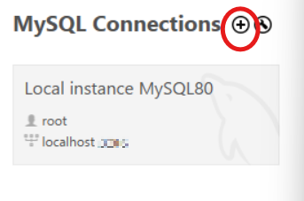
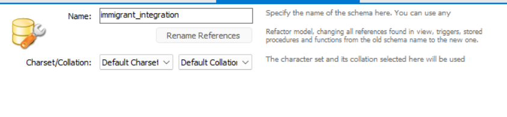
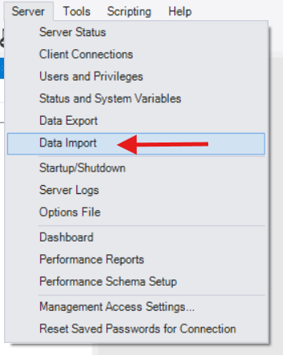

# Barriers to Immigration Integration in Texas

## Abstract

"This database projects will explore an approach to identify barriers that limit immigrant integration in Texas. 
Using a relational MySQL database and a Python-based graphical user interface built with Tkinter, our application 
allows users to manage community and service-provider information, perform CRUD operations, and run analytics that 
highlight inequalities in service access. Our database integrates real demographic data that allows us to visualize 
legal challenges that are presented. The final application demonstrates the value of combining databases with a 
user-friendly front-end."

## Step-By-Step Process to set up project

### Step 1: Application Checks

Make sure you have python installed and MySQL Workbench. 

You can install Python 3.13* at this website: https://www.python.org/downloads/

You can install mySQL Workbench at this website: https://dev.mysql.com/downloads/workbench/

### Step 2: Configuring application

**ALL** SQL text files will be included in a folder in GitHub called *Database_Barrier_To_Immigration_Integration*.

Within **app_tk.py** there is a section near the beginning of the code called ```DB_CFG = {...}```

The only code you have to change is if you set the password to a different number other than the one provided here. 
The Hostname may change as well as the Port depending on your configuration of the server. 
Make sure to note down your changes when setting up your server in Workbench.

Adding the connection to server





Naming the connection. Do not change your hostname nor port but keep in mind the numbers.


Create a new schema within your server. Make sure it has the exact naming convention as *immigration_integration*




Import your files from the *Dump Project Folder*. 




Additionally, you do not need to have MySQL Workbench open to have this application working since it runs on a local
host (AKA, your pc).
